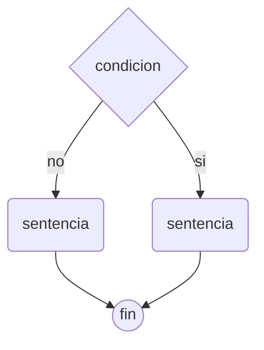
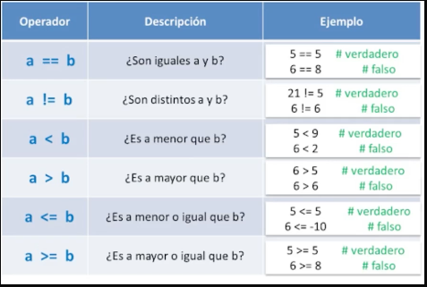
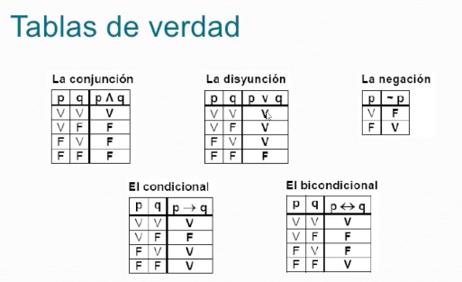

---
tags:
 - bash
 - shell
date: 2023-06-04
author: 'julioclavijo'
aliases: "Condicionales"
---

[inicio](../../README.md)

# Condicionales

## Definición
Desiciones que tomamos, siempre retorna un valor booleano:


## Sentencia if

Tabla de condiciones


### Operadores relacionales
Estos operadores tienen la función de comparación y comprobación del condicional.
Si se definen las variables a y b, la aplicación de los operadores relacionales de la siguiente manera:

- `a == b` → ¿Son iguales a y b?
- `a != b` → ¿Son distintos a y b?
- `a < b` → ¿Es a menor que b?
- `a > b `→ ¿Es a mayor que b?
- `a <= b` → ¿Es a menor o igual que b?
- `a >= b` ¿Es a mayor o igual que b?

Además de estos, existe una segunda forma de aplicar los operadores relacionales que se describen a continuación.

*En bash*
- `-eq` → Igual a
- `-ne` → No es igual a
- `-gt` → Mayor a
- `-ge` → Mayor o igual a
- `-lt` → Menor a
- `-le` → Menor o igual a

**Tablas de verdad**




### Aplicación del condicional

Para aplicar el condicional, se utiliza la palabra reservada `if`. 

#### Operadores lógicos
`&&` (AND), `||` (OR) y `!` (NOT)

**Ejemplo**
``` bash
#!/bin/bash
edad=0
year=0

read -p "Ingrese su edad: " edad
read -p "Ingrese el año: " year
if (($edad >= 18)); then
    echo "Eres mayor de edad."
fi
if [ $edad -lt 18 ]; then
    echo "Eres menor de edad."
fi
if [ $edad -lt 18 ] && [ $year -eq 2021 ]; then
    echo "Puedes votar en $year."
fi

```

Así mismo, para el cierre del condicional se hace uso de la palabra reservada `fi`

## Sentencia Else
Continuacion de la sentencia `if` en caso de que no valide `if`

```bash
#!/bin/bash
edad=0
year=0

read -p "Ingrese su edad: " edad
read -p "Ingrese el año: " year
if (($edad >= 18)); then
    echo "Eres mayor de edad."
else
	echo "No eres una persona mayor de edad"
fi
if [ $edad -ge 18 ]; then
    echo "Eres menor de edad."
fi
if [ $edad -ge 18 ] && [ $year -eq 2023 ]; then
    echo "Puedes votar en $year."
else
	echo "No puedes sufragar"
fi
```

## Condicionales Anidados
Cuando la condiciones no se cumple o necesita mas caminos
**Ejercicio**
Realizar un programa que pida tres notas de un alumno, calcule el promedio e imprima lo siguiente:
- Si el promedio es >= 7 mostrar "Promocionado"
- Si el promedio es >4 y <=6 mostrar "Regular"
- Si el promedio es <4 mostrar "Reprobado"

```bash
#!/bin/bash
nota1=0
nota2=0
nota3=0
promedio=0

read -p "Ingrese la primera nota: " nota1
read -p "Ingrese la segunda nota: " nota2
read -p "Ingrese la tercera nota: " nota3

promedio=$(((nota1+nota2+nota3)/3))
echo "El promedio de las tres notas es $promedio"

if [ $promedio -ge 7 ];then
    echo "Promocionado"
else
    if [ $promedio -gt 4 ] && [ $promedio -le 6 ]; then
        echo  "regular"
    else
        echo "No promocionado"
    fi
fi
```

## Case
Es una manera diferente de hacer condiciones
```bash
# !/bin/bash
# Dado un mes determinaar el numero de mes el usario
mes=""
echo "---"
read -p "Ingrese  el nombre del mes: " mes 

echo "---"

case $mes  in
    "enero") echo "El mes 1";;
    "febrero") echo "El mes 2";;
    "marzo") echo "El mes 3";;
    "abril") echo "El mes 4";;
    "mayo") echo "El mes 5";;
    "junio") echo "El mes 6";;
    "julio") echo "El mes 7";;
esac
```

## Resolviendo problemas condicionales

### Ejercicio 2
https://francescricart.com/ejercicios-sobre-condicionales-para-nivel-principiante/

```bash
# !/bin/bash

topping=""
helado=1.9
precioTotal=0 

read -p "Quieres acompañar tu helado con topping (oreo, kikat, brownie, lacasitos)" topping
case $topping in
    "oreo") precioTopping=1;;
    "kikat") precioTopping=1.5;;
    "brownie") precioTopping=0.75;;
    "lacasitos") precioTopping=0.95;;
esac

# bc para el calculo de flotantes
precioHeladoBash=$(echo "$helado" | bc -l)
precioTotal=$(echo "${precioTopping} + ${precioHeladoBash}" | bc -l)
echo "Tu helado cuesta: $precioTotal"
exit
```

[inicio](../../README.md)