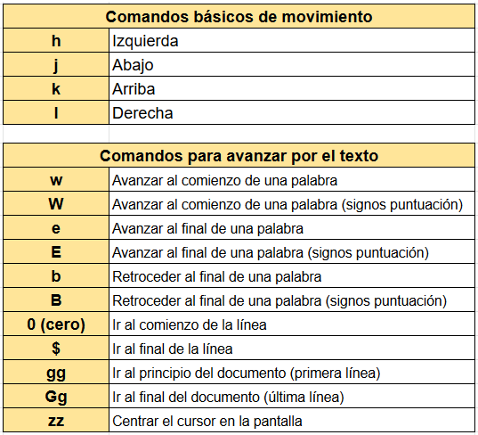

---
tags:
- Shell
- Vim
- Bash
---
[incio](../../README.md)
# Introduccion

## Contenido
¿Qué es Bash Scripting?
Crearás tus propios Scripts
Como se compone un Script internamente
Crearás Scripts interactivos
Relación Comando — Script
Complementarás tu conocimiento sobre automatizacion de procesos


## ¿Que es Shell?
Es la interfaz que nos permite acceder a los servicios (o recursos) del sistema operativo
Los dos tipos de interfaces mås conocidos son:
+ CLI (Command-Line Interface)
+ GUI (Graphic User Interface)
Es la Interacción con el sistema operativo

## ¿Que es Bash?
Es la interfaz de linea de comandos de Unix

## ¿Qué es Bash Scripting?
Es la programacion en shell para un mayor alcance de comandos, creando soluciones propias.

## Vim
Uso de vim
```bash
apt-get install vim
```
### Algunos comandos
`yy` copiar
`p` paste
`dd` pegar
`:q` salir sin cambios
`:wq` salir con cambios
`:w` guardar sin salir

**Algunos comandos**



## Configuracion del entorno de trabajo
### .vimrc archivo de incializacion
Configurar el vim, identacion y concatenacion

`set showmode` → Activa el modo para la sintaxis correcta.
`set autoindent` → Activa la auto indentation.
`set tabstop=4` → Cada vez que se tabula se asignan 4 espacios.
`set expandtab` → Activa las tabulaciones.
`syntax on` → Activa la sintaxis en VIM.
`set number` -> muestra el numero de linea

ejmplo básico de configuración `.vimrc`
```conf
set showmode 
set autoindent
set tabstop=4
set expandtab
set number
set ruler
syntax on
```

